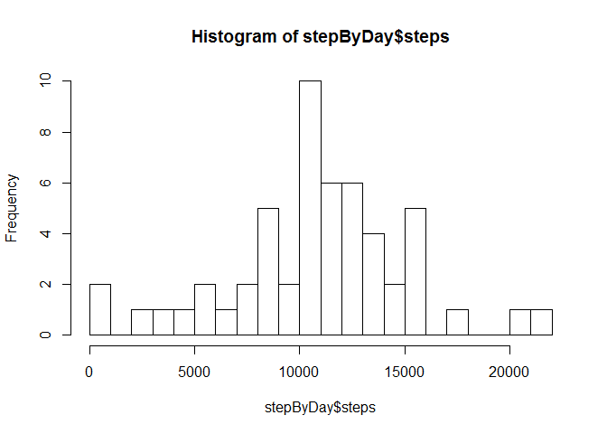
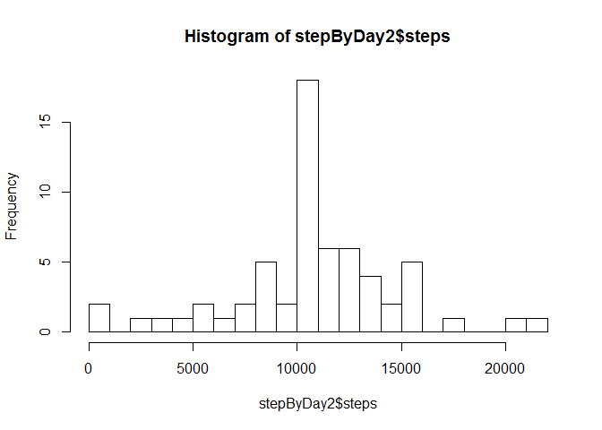
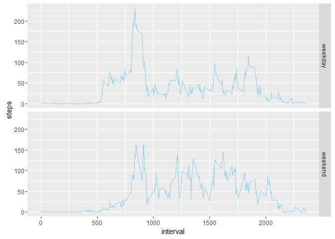

# PA1_template
dplcoursera2016  
7 March 2016  

## Loading and preprocessing the data


```r
stepdata = read.csv("activity.csv")
```

## What is mean total number of steps taken per day?
Used aggregate function to sum steps over days.  
Since aggregate function avoids na values, did not need to pre-process the data set supplied.  
Plotted a histogram with 20 intervals, calculated mean and median, and displayed these using cat function.  


```r
stepByDay = aggregate(steps~date, stepdata, sum)
hist(stepByDay$steps,breaks=20)
```



```r
meansteps = mean(stepByDay$steps)
mediansteps = median(stepByDay$steps)
cat("mean number of steps per day is ", meansteps, "\n");
```

```
## mean number of steps per day is  10766.19
```

```r
cat("median number of steps per day is ", mediansteps, "\n")
```

```
## median number of steps per day is  10765
```

Showed that data is fairly symmetric, and that     
- average is about 10766.19 steps per day
- median is 10765 steps per day

##What is the average daily activity pattern?
Used aggregate function to average steps over 5-min intervals.  
Plotted results as a line graph to see the average pattern of steps during the day.  
Used max function to extract maximum (5-min) step number,  
and identified the interval in which this occurs, displaying result using cat funtion.  
Interval 835 has maximum average, which was 206.17 steps  

```r
stepByInterval = aggregate(steps~interval, stepdata, mean)
with(stepByInterval,plot(steps~interval,type="l"))
```


```r
maxSteps = max(stepByInterval$steps)
maxStepInterval = stepByInterval[stepByInterval$steps >= maxSteps,1]
cat("interval with maximum average steps is ",maxStepInterval," with ",maxSteps," steps", "\n")
```

```
## interval with maximum average steps is  835  with  206.1698  steps
```

##Inputing missing values
Extracted intervals as vectors from data set.  
Created a vector of means (same length as intervals) using average step by interval in last part.  
Created a duplicate of original data, then used  for-loop to replace na values in steps column with average for the matching interval value.  
Histogram, mean and median show that by this replacement method, mean is unchanged, but that median becomes equal to mean (unsure if this is a general effect, or sepcific to this data set)  

```r
intervals = stepdata$interval
means = stepdata$steps
for(i in 1:length(intervals)){means[i] = stepByInterval[stepByInterval[,1]==intervals[i],2] }
stepdata2 = stepdata
for(i in 1:length(intervals)){if(is.na(stepdata2[i,1])){stepdata2[i,1] = means[i]} }
library(dplyr)
```

```
## 
## Attaching package: 'dplyr'
```

```
## The following objects are masked from 'package:stats':
## 
##     filter, lag
```

```
## The following objects are masked from 'package:base':
## 
##     intersect, setdiff, setequal, union
```

```r
stepByDay2 = aggregate(steps~date, stepdata2, sum)
hist(stepByDay2$steps,breaks=20)
```



```r
meansteps2 = mean(stepByDay2$steps)
mediansteps2 = median(stepByDay2$steps)
cat("mean number of steps per day after na replacement is ", meansteps2, "\n");
```

```
## mean number of steps per day after na replacement is  10766.19
```

```r
cat("median number of steps per day after na replacement is ", mediansteps2, "\n")
```

```
## median number of steps per day after na replacement is  10766.19
```

##Are there differences in activity patterns between weekdays and weekends?
loaded ggplot2 library  
Created a new data set by first adding a column with day names, and hence another column with the weekend/weekday classification specified in assignment   


```r
library(ggplot2)
stepdata3=mutate(stepdata2, day = factor(weekdays(as.POSIXct(date))))
stepdata3=mutate(stepdata3, daytype = factor(day=="Saturday" | day=="Sunday", labels=c("weekday","weekend")))
stepByInterval3= aggregate(steps~interval+daytype, stepdata3, mean)
```

Created a pair of plots of average steps against 5-min interval, conditioned on weekend/weekday  


```r
p <- ggplot(stepByInterval3, aes(x=interval, y=steps))+geom_line(color="skyblue")+facet_grid(daytype~.)
print(p)
```




Plots seem to indicate that steps begin later on the weekend, and continue later.  
Larger peak of steps early on weekdays (travel to work?), but a higher average during most of day at weekends.  
